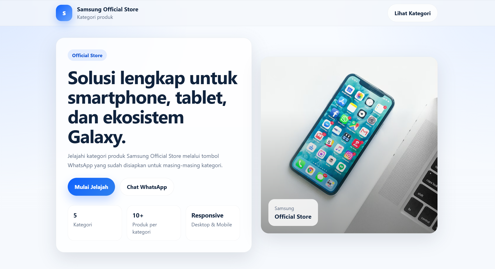

# Samsung Official Store Welcome Page


Welcome Page sederhana untuk scraping Shopee & integrasi chatbot WhatsApp.

Halaman ini menampilkan:
- Nama toko (Samsung Official Store)
- Daftar kategori produk
- Tombol chatbot WhatsApp untuk setiap kategori
- Responsive design (desktop, tablet, mobile)

---

# Struktur Project

```bash
samsung-welcome-page/
│
├── index.html
├── style.css
└── README.md

```
# Cara Menjalankan Project Secara Lokal
1. Clone Repository
```bash
git clone https://github.com/DaffaYusufM/RAG-SamsungStore.git
```
2. Masuk ke Folder Project
```bash
cd RAG-SamsungStore
```
3. Buka File
Buka index.html di vscode, kemudian ubah nomor WhatsApp Chatbot.
Semua link WhatsApp menggunakan format berikut:
```bash
https://wa.me/NOMOR_WHATSAPP
```
contoh :
```bash
https://wa.me/6281234567890
```
4. Pastikan chatbot berjalan dengan lancar saat demo!

# Catatan Developer
1. Pastikan semua tombol WhatsApp aktif
2. Pastikan kategori sesuai pembagian anggota kelompok
3. Code yang di ubah cukup bagian nomor chatbot saja
4. Pastikan membuat branch lokal terlebih dahulu sebelum develop
5. Push code ke branch lokal yang sudah di buat kemudian di merge ke branch main jika sudah tidak terdapat error

# Pembagian Kategori
| Anggota   | Kategori         |
| --------- | ---------------- |
| Danot     | Smartphone       |
| Daffa     | Tablets          |
| Anggota 3 | Galaxy AI        |
| Anggota 4 | Home Appliances  |
| Anggota 5 | Galaxy Ecosystem |
